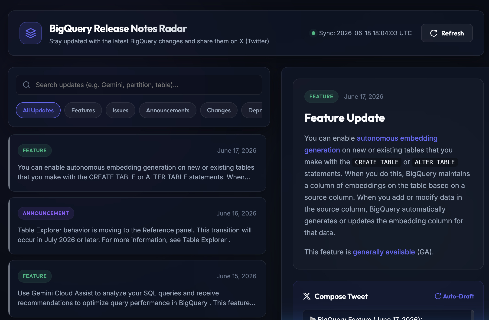

# BigQuery Release Monitor

This project was built using an AI-augmented development workflow. Moving beyond basic "vibe coding," the application utilizes an AI-assisted foundation that was manually modified and strictly architected to ensure complete system control, resilience, and reliability.

## About

This tool is designed to intercept and structure the Google BigQuery release notes feed. As part of a **course/competition from Kaggle & Google**, this agent is a blend of machine generated code + a human-in-the-middle approach. Some of the code portions have been refined by me, as for example the dynamic port allocation for preview, the CI pipeline, and others.

Primarily, this tool uses AI-generated workflows + agent creation, and newly-launched and updated Google tools: such as Antigravity tools and technologies, including the CLI, IDE, and others.

## Preview
An open-source experiment in AI-assisted development and local system infrastructure.

## Core traits, architecture, and modifications:
* **Man-in-the-Middle strategy:** Acts as a local interceptor, pulling the official unstructured XML/HTML feed and parsing it via regex into clean, machine-readable JSON.

* **Dynamic port allocation:** The core Flask server logic was manually rewritten to proactively scan for and bind to an available ephemeral port, permanently resolving local environment conflicts.

* **Automated CI/CD & (mini)-testing:** Fully integrated with GitHub Actions. The continuous integration pipeline automatically handles the minimally-required testing, building, and generating visual documentation for every release.

* **Smart caching:** Employs a 10-minute in-memory cache to reduce external API load and bypass rate limits.

* **License and usage:** The license is extremely permissive. I believe this agent was well written and with some modifications, it became even nicer. The purpose of this AI-powered agent is for idiomatic code writing, flow optimization, and educational purposes. 🤟
